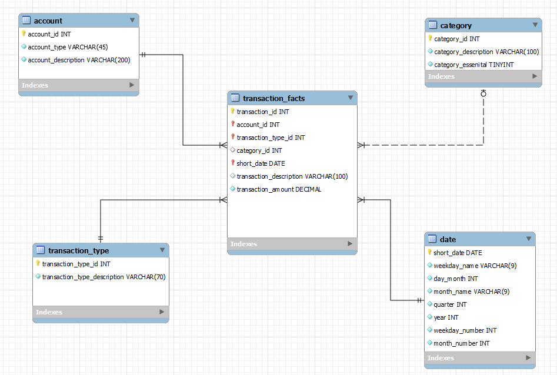
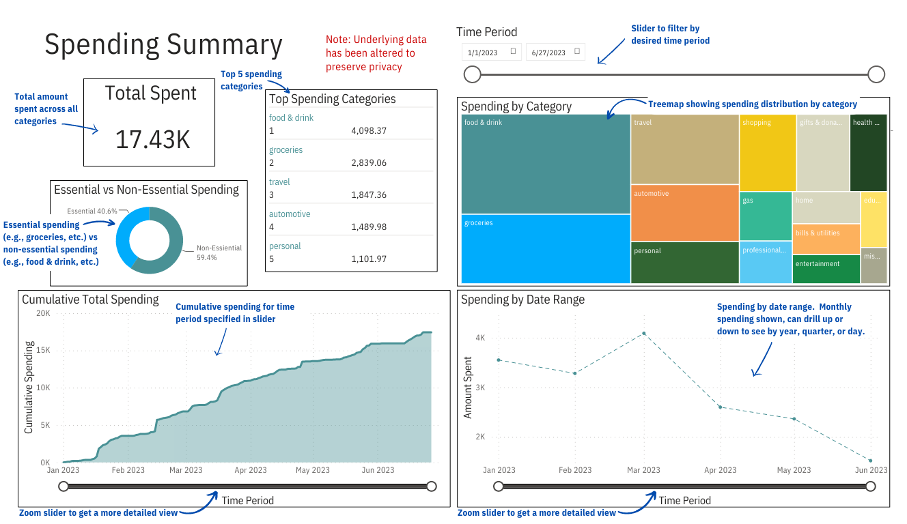

# 💰 Personal Finance Database & Dashboard

## 📌 Introduction
I developed a **MySQL database** called `spend_save` to track **all financial transactions** – purchases, deposits, withdrawals, credit card payments, and more. Transactions are extracted from my **banking website (CSV files)**, transformed using **Python scripts**, and loaded into the **database via SQLAlchemy**. SQL views were created to analyze spending habits, and a **Power BI dashboard** was built for visual insights. 🚀

## 🛠 Technologies & Skills
- **💾 Database**: MySQL, MySQL Workbench
- **🐍 Programming**: Python (NumPy, Pandas, SQLAlchemy)
- **📊 Data Visualization**: Power BI, DAX

## 🎯 Why This Project?
I wanted to:
✅ Gain better **insights into my spending habits** 💳
✅ Track **monthly and category-based expenses** 📈
✅ Monitor **bank balances over time** 💵

---

## 🔍 Identifying Requirements
My goal was to **monitor every financial transaction** across **bank and credit card accounts**. I categorized transactions into different **types (purchases, paycheck deposits, bill payments, etc.)** and recorded their **dates** for tracking trends.

## 🏗 ER Diagram & Database Schema
To achieve this, I built a **dimensional model** with **4 dimension tables** and **1 fact table**:

The `account`, `transaction_type`, `category`, and `date` tables provide detailed metadata for transactions in `transaction_facts`. The `category` dimension is optional, as **only debit and credit card purchases** require categorization.

📌 **Check out the [Data Dictionary](database_creation/data_dictionary.md) for detailed table relationships.**

## 🏗 Database Creation
The **MySQL Workbench forward engineer** tool was used for database creation, with additional constraints enforced. 
🔗 **View the [Database Creation Script](database_creation/final_database_creation_script.sql).**

## 📂 Loading Data into Dimension Tables
Data was **loaded via CSV files** into dimension tables. Check out sample data here: 📁 [Dimensions Data](database_creation/dimensions_data)

## 🔄 Transactions Processing & Loading
1️⃣ **Extracted account data** from online banking (CSV files for savings, checking, and credit cards).
2️⃣ **Processed transactions in Python (Pandas, NumPy).**
3️⃣ **Automated transformations** with custom functions for accuracy.
4️⃣ **Manually reviewed** edge cases to ensure correctness.

🚀 **View the processing functions:**
- 🏦 [Savings Transactions Processing](transactions_processing/savings_processing_example.ipynb)
- 💳 [Checking Transactions Processing](transactions_processing/checking_processing_example.ipynb)
- 🏷️ [Credit Card Transactions Processing](transactions_processing/cc_processing_example.ipynb)

> 🛑 **Note:** All transaction details have been modified for privacy.

---

## 🛢 SQL Analysis & Database Views
To analyze **monthly expenses, spending categories, and balance trends**, I created **SQL views**. This allowed me to quickly access key insights.

🔍 **View SQL code & sample outputs:** [Database Views Overview](database_views/views_overview.ipynb)

## 📊 Power BI Dashboard
I connected Power BI to the `spend_save` database, importing tables and **1 key SQL view** for real-time visualization. 🚀

### 🏗 Dashboard Data Model
🔗 [View the Dashboard Data Model](dashboard/dashboard_model.md)

### 📊 Dashboard Preview

🚀 **[Click here to explore the interactive dashboard!](https://app.powerbi.com/view?r=eyJrIjoiMjkyNjBlYzMtMDMwMi00MWU1LWExMGItNDMyNzYzZTgyNzkyIiwidCI6IjVmODc4N2Q0LThkNmYtNGI1ZC1hNWY4LTM3MzI0YWFhZDYwMSJ9)**

### 🔍 Key Insights from My Spending Analysis
📌 **Major spending category:** Dining out (food & drinks) 🍔
📌 **Highest spending months:** **January – March** (unexpected trend!) 📆
📌 **Better awareness of non-essential spending** leading to smarter budgeting 💡

## 🚀 Conclusion
This **database and dashboard** empower me to **track, analyze, and optimize my personal finances**. With real-time insights, I can **identify spending trends, adjust habits, and improve financial health**. Future improvements include **automated data ingestion and predictive analytics**! 🔥

---

    <b><a href="#top">⬆️ Back to top</a></b>

